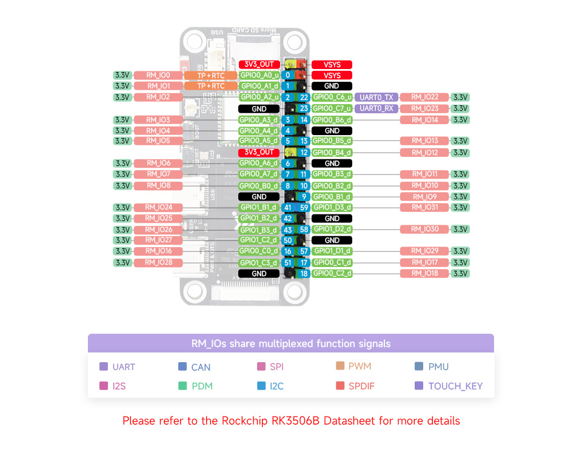

### Porting `panel-mipi-dbi` Driver to Luckfox Pico Pi Development Board

| Board          | Luckfox Lyra Zero W |
|----------------|-------------------|
| Distro         | Buildroot    |
| Kernel Version | 6.1.99          |
| Display Module | [RPi DM YT350S006](https://embeddedboys.github.io/RPi_DM_YT350S006/) |


### Get started

```bash
adb push prebuilt/* /root/
adb wait-for-device && adb shell 'dd if=/root/boot.img of=/dev/mmcblk0p4 bs=1M && reboot'
adb wait-for-device && adb shell 'insmod /root/panel-mipi-dbi.ko'
```

Now you can see the console appears on the screen

#### Autoload

At device side, change to root user then:
```bash
mkdir -p /lib/modules/$(uname -r)/kernel/drivers/gpu/drm/tiny/
cp /root/panel-mipi-dbi.ko /lib/modules/$(uname -r)/kernel/drivers/gpu/drm/tiny/

echo "kernel/drivers/gpu/drm/tiny/panel-mipi-dbi.ko:" >> /lib/modules/$(uname -r)/modules.dep
reboot
```

### Build with Luckfox Pico SDK

#### 1. build and copy the new boot.img to the device

```bash
cp rk3506b-luckfox-lyra-zero-w.dts ${HOME}/luckfox/lyra/kernel-6.1/arch/arm/boot/dts/rk3506b-luckfox-lyra-zero-w.dts
./build.sh kernel
adb push kernel-6.1/zboot.img /root
```

come to the device side and run this if boot from SPI-NAND:
```bash
dd if=/root/zboot.img of=/dev/mtdblock1 bs=1M && reboot
```
or this one if boot from SD card:
```bash

```

build driver and firmware, then copy to the device:
```bash
make
adb push panel-mipi-dbi.ko /root/
adb push panel-mipi-dbi-spi.bin /root/
```

at device side:
```bash
cp /root/panel-mipi-dbi-spi.bin /lib/firmware/
insmod /root/panel-mipi-dbi.ko
```

and if everything is okay, `dmesg` should be messages like:
```c
[ 2885.983378] panel-mipi-dbi-spi spi0.0: supply power not found, using dummy regulator                                                   
[ 2885.990327] [drm] Initialized panel-mipi-dbi 1.0.0 20220103 for spi0.0 on minor 0                                                      
[ 2886.396361] Console: switching to colour frame buffer device 60x40                                                                     
[ 2886.447797] panel-mipi-dbi-spi spi0.0: [drm] fb0: panel-mipi-dbid frame buffer device 
```


