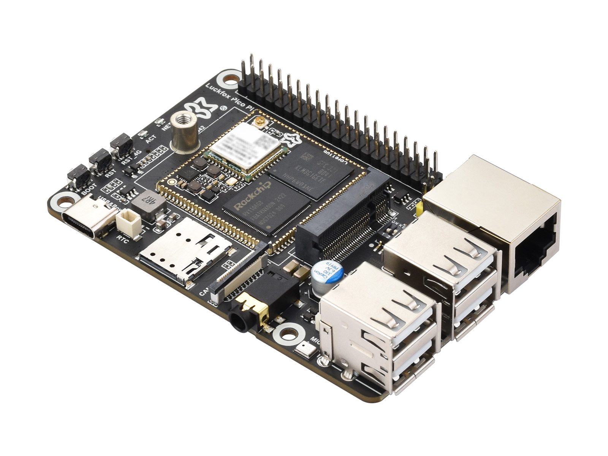
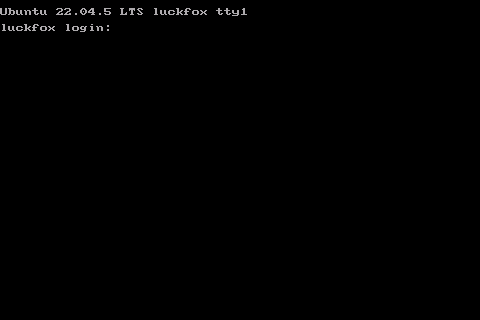

### Porting `panel-mipi-dbi` Driver to Luckfox Pico Pi Development Board



| Board          | Luckfox Pico Pi W |
|----------------|-------------------|
| Distro         | Ubuntu 22.04.5    |
| Kernel Version | 5.10.160          |
| Display Module | [RPi DM YT350S006](https://embeddedboys.github.io/RPi_DM_YT350S006/) |


### Get started

```bash
adb push prebuilt/* /root/
adb wait-for-device && adb shell 'dd if=/root/boot.img of=/dev/mmcblk0p4 bs=1M && reboot'
adb wait-for-device && adb shell 'insmod /root/panel-mipi-dbi.ko'
```

Now you can see the console appears on the screen



#### Autoload

At device side, change to root user then:
```bash
mkdir -p /lib/modules/$(uname -r)
cp /root/panel-mipi-dbi.ko /lib/modules/$(uname -r)

echo "panel-mipi-dbi" > /etc/modules-load.d/modules.conf
reboot
```

### Build with Luckfox Pico SDK

#### 1. build and copy the new boot.img to the device

```bash
cp rv1106g-luckfox-pico-pi-w.dts ${HOME}/luckfox/pico/sysdrv/source/kernel/arch/arm/boot/dts/rv1106g-luckfox-pico-pi-w.dts
./build.sh kernel
adb push output/image/boot.img /root/
```

come to the device side and run:
```bash
dd if=/root/boot.img of=/dev/mmcblk0p4 bs=1M && reboot
```

build driver and firmware, then copy to the device:
```bash
make
adb push panel-mipi-dbi.ko /root/
adb push panel-mipi-dbi-spi.bin /root/
```

at device side:
```bash
cp /root/panel-mipi-dbi-spi.bin /lib/firmware/
insmod /root/panel-mipi-dbi.ko
```

and if everything is okay, `dmesg` should be messages like:
```c
[ 2885.983378] panel-mipi-dbi-spi spi0.0: supply power not found, using dummy regulator                                                   
[ 2885.990327] [drm] Initialized panel-mipi-dbi 1.0.0 20220103 for spi0.0 on minor 0                                                      
[ 2886.396361] Console: switching to colour frame buffer device 60x40                                                                     
[ 2886.447797] panel-mipi-dbi-spi spi0.0: [drm] fb0: panel-mipi-dbid frame buffer device 
```