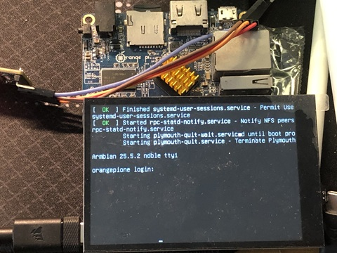

# OrangePi One panel-mipi-dbi driver for Raspberry Pi Display HATs

rpi-dm-hp35006 is the default display module for this project.



lists of compatible hardware:

- [rpi-dm-hp35006]()
- [rpi-dm-yt350s006]()
- [rpi-dm-cl35bc219-40a]()

## TODO

- [x] add backlight node in dt overlay
- [ ] add touchscreen node in dt overlay

## Get started

clone this repo first

```bash
git clone https://github.com/embeddedboys/pico_dm_yt350s006_linux.git
cd orangepi-one
```

build and install dt overlay, firmware (ignore warnings)

```bash
make

sudo cp panel-mipi-dbi.bin /lib/firmware/
sudo cp sun8i-h3-spi-st7796u-drm.dtbo /boot/dtb/overlays/
```

add firmware initramfs hook

```bash
sudo cp initramfs-hook-panel-mipi-dbi-fw /etc/initramfs-tools/hooks/
sudo chmod u+x /etc/initramfs-tools/hooks/initramfs-hook-panel-mipi-dbi-fw
```

update initramfs

```bash
update-initramfs -u -v

# Calling hook panel-mipi-dbi-fw
# Adding binary /lib/firmware/panel-mipi-dbi-spi.bin
```

check if firmware was successfully included

```bash
root@orangepione:~# lsinitramfs /boot/initrd.img-$(uname -r) | grep panel-mipi-dbi-spi.bin
usr/lib/firmware/panel-mipi-dbi-spi.bin
```

load the panel-mipi-dbi driver manually
```bash
modprobe panel-mipi-dbi
```

## References

https://github.com/notro/panel-mipi-dbi/wiki
https://github.com/armbian/sunxi-DT-overlays
https://github.com/embeddedboys/rpi_dm_yt350s006_software

## More

Some useful log during development:

```c
[    3.344267] panel-mipi-dbi-spi spi0.0: /soc/spi@1c68000/st7796u@0: failed to get panel-timing (error=-2)
```

```c
[    3.341665] panel-mipi-dbi-spi spi0.0: /soc/spi@1c68000/st7796u@0: panel-timing out of bounds
```

```c
[    3.350494] panel-mipi-dbi-spi spi0.0: Direct firmware load for panel-mipi-dbi-spi.bin failed with error -2
[    3.350538] panel-mipi-dbi-spi spi0.0: Falling back to sysfs fallback for: panel-mipi-dbi-spi.bin
[   64.499684] panel-mipi-dbi-spi spi0.0: No config file found for compatible 'panel-mipi-dbi-spi' (error=-110)
[   64.499725] panel-mipi-dbi-spi spi0.0: probe with driver panel-mipi-dbi-spi failed with error -110
```

```c
[  101.558427] panel-mipi-dbi-spi spi0.0: supply power not found, using dummy regulator
[  101.558866] panel-mipi-dbi-spi spi0.0: supply io not found, using dummy regulator
[  101.568591] [drm] Initialized panel-mipi-dbi 1.0.0 for spi0.0 on minor 2
[  102.004418] panel-mipi-dbi-spi spi0.0: [drm] fb0: panel-mipi-dbid frame buffer device
```

```c
[    3.353540] panel-mipi-dbi-spi spi0.0: supply power not found, using dummy regulator
[    3.353769] panel-mipi-dbi-spi spi0.0: supply io not found, using dummy regulator
[    3.359262] panel-mipi-dbi-spi spi0.0: Direct firmware load for panel-mipi-dbi-spi.bin failed with error -2
[    3.359305] panel-mipi-dbi-spi spi0.0: Falling back to sysfs fallback for: panel-mipi-dbi-spi.bin
[   64.499367] panel-mipi-dbi-spi spi0.0: No config file found for compatible 'panel-mipi-dbi-spi' (error=-110)
[   64.499409] panel-mipi-dbi-spi spi0.0: probe with driver panel-mipi-dbi-spi failed with error -110
[   66.353427] EXT4-fs (mmcblk0p1): mounted filesystem c8a78f05-cc75-4985-a1b3-b0b16465824d ro with writeback data mode. Quota mode: none.
```
